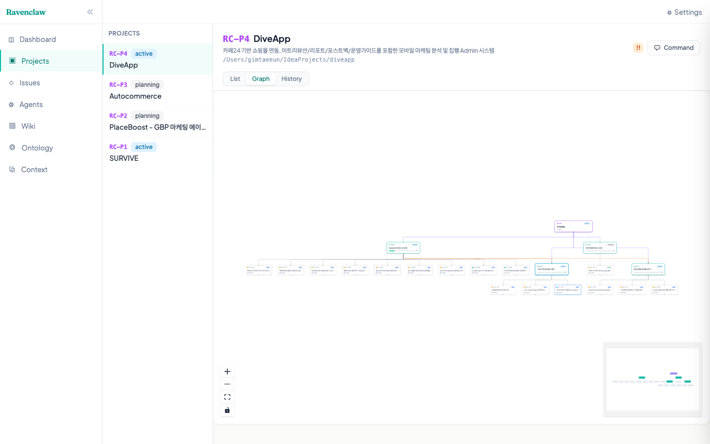
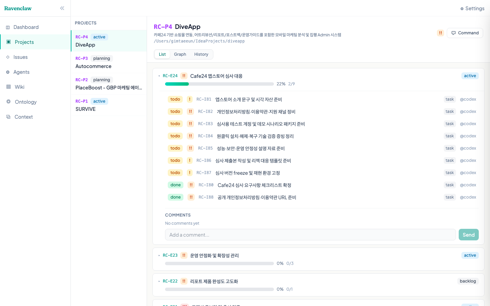
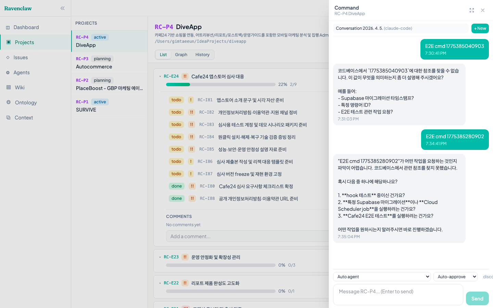
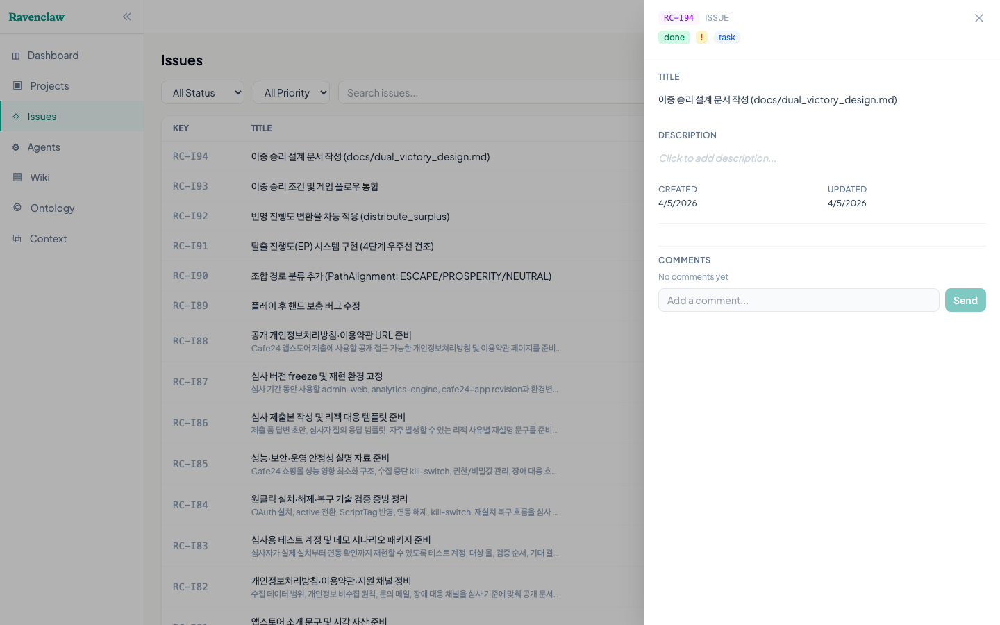

# Ravenclaw

**Work context management system for AI coding agents.**

Ravenclaw gives AI agents persistent memory across sessions. Instead of re-explaining your project every time, agents start with full awareness — what's been built, what's in progress, and what to do next.

> Web UI where you instruct agents, monitor their work in real-time, and manage project context — all in one place.



## Why Ravenclaw?

AI coding agents (Claude Code, Gemini CLI, Codex) are powerful — but they forget everything between sessions. Managing multiple projects with multiple agents gets chaotic fast:

- "Where did I leave off?" repeated every session
- Context lost when switching between projects
- No visibility into what agents are doing
- No structured way to break down and track work

Ravenclaw solves this with a **project management system that agents can read and write** — via MCP tools, CLI, or REST API.

## Screenshots

| Projects + Epics | Chat with Agent |
|:---:|:---:|
|  |  |
| **Graph View** | **Detail Panel** |
|  |  |

## Key Features

### Agent Orchestration
- **Web-based chat** — Send instructions to agents directly from the browser
- **Real-time streaming** — Watch agent responses as they type (SSE)
- **Conversation continuity** — Sessions persist across messages via `claude --resume`
- **Multi-agent support** — Claude Code, Gemini CLI, Codex
- **Permission control** — Auto-approve, bypass, accept-edits, or interactive mode
- **Tool activity indicator** — See "Running: Bash", "Running: Edit" in real-time

### Project Management
- **Three-level hierarchy** — Project > Epic > Issue with dependency tracking
- **Interactive graph view** — Visual project structure with clickable nodes
- **Detail panel** — Click any item to view/edit description, status, metadata inline
- **Progress tracking** — Epic progress auto-calculated from issue completion
- **Wiki & Ontology** — Versioned knowledge base with auto-extracted concept graph

### Context & Sessions
- **Context handoff** — Agents save snapshots; new sessions load where the last left off
- **Human-in-the-loop** — Agents ask questions, users answer via web UI
- **Session locking** — Epic-level locks prevent concurrent agent conflicts
- **Persistent chat history** — Conversations stored in DB, survive server restarts

## Architecture

```
┌──────────────┐
│ Web Dashboard │  React + Tailwind + ReactFlow
└──────┬────────┘
       │
┌──────┴────────┐     ┌────────────┐     ┌────────────┐
│  API Server   │─────│ PostgreSQL │     │  AI Agent   │
│  (Hono)       │     └────────────┘     │(Claude/etc.)│
└──┬────┬───┬───┘                        └──────┬──────┘
   │    │   │                                   │
   │    │   └── Process Manager ────────────────┘
   │    │       (spawn, stream, resume)
   │    └── REST API + SSE Streaming
   │
   └── Conversations (DB-persisted, session continuity)

┌────────────┐     ┌────────────┐
│ MCP Server │     │  CLI (rc)  │
│ (40+ tools)│     │            │
└────────────┘     └────────────┘
```

| Package | Description |
|---------|-------------|
| `@ravenclaw/core` | DB schema (Drizzle ORM), services, types |
| `@ravenclaw/api` | Hono REST API + Process Manager + SSE + Conversations |
| `@ravenclaw/cli` | Terminal interface (`rc` command) |
| `@ravenclaw/mcp` | MCP server for AI agent integration (40+ tools) |
| `@ravenclaw/web` | React dashboard with graph view and interactive chat |

## Quick Start

```bash
git clone https://github.com/chainofdive/ravenclaw.git
cd ravenclaw
pnpm install && pnpm build

# Start PostgreSQL + run migrations
docker-compose up -d
pnpm db:push

# Start API server
source .env && DATABASE_URL="$DATABASE_URL" node packages/api/dist/index.js

# Start web dashboard
pnpm --filter @ravenclaw/web dev
```

See [docs/SETUP.md](./docs/SETUP.md) for detailed setup instructions.

## How It Works

```
Agent starts a session
  │
  ├─ get_latest_context(RC-P1)      ← load previous handoff
  ├─ start_work_session(...)        ← record session
  ├─ get_project(RC-P1)             ← see full project tree
  │
  ├─ start_issue(RC-I26)            ← pick up a task
  ├─ ... coding ...
  ├─ complete_issue(RC-I26)         ← mark done (epic progress updates)
  ├─ save_context(RC-P1, "...")     ← save progress for next session
  │
  ├─ request_human_input(...)       ← ask user if needed
  └─ end_work_session(...)          ← close session
```

Or via the **web UI**: type a message → agent works in the project directory → stream results back in real-time.

## Data Model

```
Workspace
  └─ Project (RC-P1)                    ← product / game / campaign
       │  directory: /path/to/project   ← agents run here
       ├─ Epic (RC-E10: Phase 1)        ← milestone (depends_on other epics)
       │    ├─ Issue (RC-I26: task)      ← individual task
       │    └─ Issue (RC-I27: task)      ← depends_on RC-I26
       └─ Conversation                  ← persistent chat with agent
            └─ Messages (user/assistant, DB-stored)
```

Plus: Wiki pages, Ontology, Comments, Dependencies, Work sessions, Context snapshots, Human input requests, Agent directives.

## CLI

```bash
rc project create "MyApp" --directory /path/to/myapp --priority high
rc project list / show / update / delete

rc epic list / show / create / update / delete
rc issue list / create / start / done / delete

rc context                          # full work context
rc context save RC-P1 "progress..." # save snapshot
rc session start / end / list

rc wiki list / search
rc search "keyword"
rc ontology show / rebuild
```

## MCP Tools (40+)

| Category | Tools |
|----------|-------|
| **Projects** | list_projects, get_project, create_project, update_project, delete_project |
| **Epics** | list_epics, get_epic, create_epic, update_epic, delete_epic |
| **Issues** | list_issues, get_issue, create_issue, update_issue, delete_issue, start_issue, complete_issue |
| **Dependencies** | add_dependency, list_dependencies, remove_dependency |
| **Context** | get_work_context, get_work_context_summary |
| **Sessions** | save_context, get_latest_context, start_work_session, end_work_session |
| **Human Input** | request_human_input, check_human_input, list_pending_inputs |
| **Wiki** | list_wiki_pages, get_wiki_page, create_wiki_page, update_wiki_page |
| **Other** | search, list_comments, add_comment, acquire_lock, release_lock, get_ontology, rebuild_ontology |

## API

All endpoints under `/api/v1`, authenticated via `Authorization: Bearer <api-key>`.

| Group | Key Endpoints |
|-------|-----------|
| Projects | `GET/POST /projects`, `GET/PUT/DELETE /projects/:id`, `GET /projects/:id/tree` |
| Epics | `GET/POST /epics`, `GET/PUT/DELETE /epics/:id`, `GET /epics/:id/tree` |
| Issues | `GET/POST /issues`, `GET/PUT/DELETE /issues/:id`, `POST /issues/:id/start\|done` |
| Conversations | `GET .../list`, `POST .../new`, `POST .../message`, `GET .../stream` (SSE) |
| Context | `GET /context`, `GET /context/summary` |
| Sessions | `POST /sessions`, `PUT /sessions/:id/end` |
| Human Input | `POST /input-requests`, `GET .../waiting`, `PUT .../answer` |
| Wiki | `GET/POST /wiki`, `GET/PUT /wiki/:id` |
| Files | `GET /files?path=...&project_id=...` |

Full endpoint list: Dependencies, Locks, Ontology, Search, Comments, Agents, Directives, SSE streaming.

## Testing

```bash
cd packages/web && pnpm test:e2e   # 14 Playwright E2E tests
```

## Documentation

- [docs/SETUP.md](./docs/SETUP.md) — Installation and configuration
- [docs/SESSION_GUIDE.md](./docs/SESSION_GUIDE.md) — Agent session workflow

## License

[Apache 2.0](./LICENSE)
